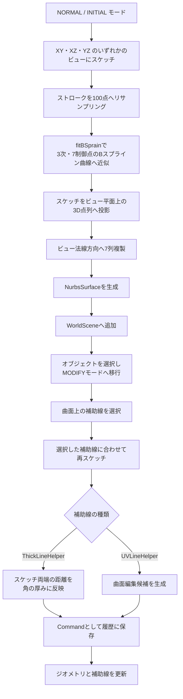
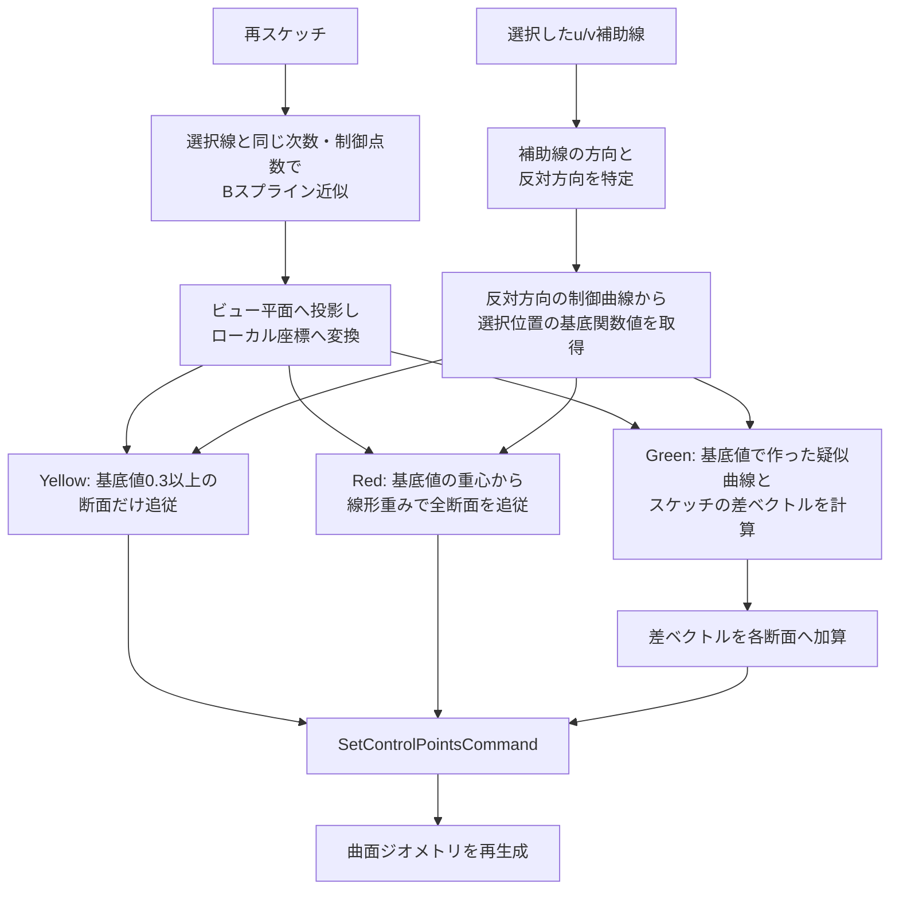
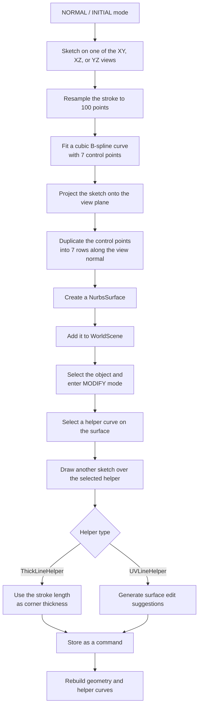
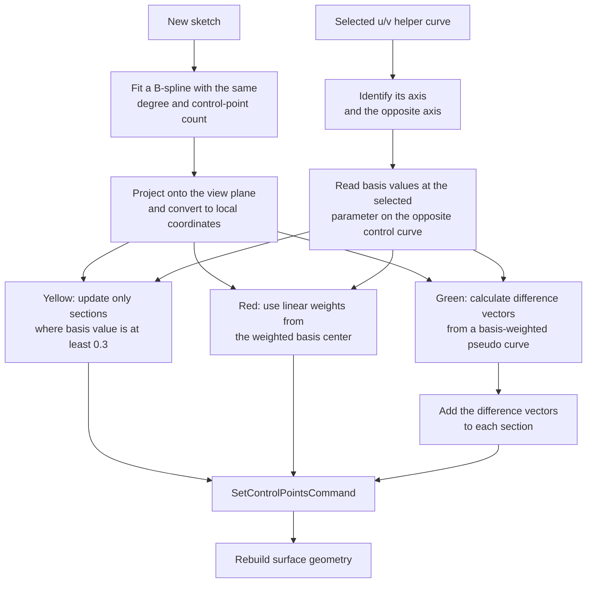

# Shelly

## 日本語

Shelly は、スケッチから複雑な曲面を直感的に設計するための 3D モデリング支援ツールです。子どもたちが自由に建築物を描き、その発想を大きな 3D プリンタなどで実空間へ出力できる世界を目標に、専門的な 3D モデリング操作をスケッチ中心の操作へ置き換えることを目指しています。

参考:

- 作品ページ: https://www.honma.site/ja/works/shelly/

### 概要

ユーザーは 3 つの正投影ビューのいずれかに大まかな曲面形状をスケッチし、システムはその線を B スプライン曲線として近似します。近似した曲線の制御点を、そのビューの法線方向へ複製することで B スプライン曲面を生成し、右上の 3D ビューで形状を確認できます。

生成後は、曲面上の特定の補助線を選択し、その線に新しいスケッチを重ねることで形状を編集できます。編集時には、選択した曲線とスケッチの差分を周辺の曲線へどう反映するかについて、複数の候補を提示します。

### 主な機能

- 三面図と 3D ビューを組み合わせた 2x2 レイアウト
- スケッチ線からの B スプライン曲線近似
- B スプライン曲線の制御点をもとにした曲面生成
- 曲面上の u/v 方向補助線の選択
- 選択した補助線へのスケッチ追従による曲面編集
- 周辺曲線への影響のかけ方を複数候補として提示
- ソリッド、横ストライプ、縦ストライプ、格子状の表示切り替え
- 角の厚み編集とグリッドパラメータ調整
- Undo / Redo
- STL エクスポート

### 操作の流れ



### 編集候補の考え方

曲面編集では、選択した曲線に対するスケッチの変形をそのまま全体へ適用するのではなく、周辺の曲線へどう伝播させるかを候補として提示します。



実装上は `NurbsSurfaceController` がスケッチを 3D 平面へ投影し、`fitBSprain` で近似した曲線と既存曲面の制御点列を比較します。その後、基底関数の値、線形重み、差ベクトルを使って 3 種類の `SuggestionHelper` を生成し、選択された候補を `SetControlPointsCommand` として履歴に積みます。現状のコードでは Yellow 候補が生成直後に既定候補として適用され、Red / Green 候補はボタンイベントで適用されます。

### 技術構成

- TypeScript
- Vite
- Three.js
- NURBS / B-spline
- mathjs

### ディレクトリ構成

- `src/main.ts`: アプリケーションの起動処理、三面図と 3D ビューの初期化
- `src/scene/`: Three.js シーン、背景面、イベント処理
- `src/canvas/`: スケッチ用 Canvas レイヤ
- `src/curve/`: NURBS 曲線・曲面表現
- `src/model/`: 曲面モデルとジオメトリ生成
- `src/view/`: 補助線や候補表示
- `src/controller/`: スケッチ編集、候補生成、操作確定
- `src/history/`: Undo / Redo 用コマンド
- `src/utils/`: B スプライン基底関数、最小二乗近似、共通処理
- `public/`: 3D モデルや音声などの静的ファイル

### 実行方法

依存関係をインストールします。

```bash
npm install
```

開発サーバーを起動します。

```bash
npm run dev
```

ビルドします。

```bash
npm run build
```

### メモ

このリポジトリは、ゼミ内のプログラミング LT で発表したプロトタイプです。3D モデリング経験のない高校生による試用では、チュートリアル後の短い制作時間でも、雲をイメージした格子状の構造物のような複雑な形状を作ることができました。

## English

Shelly is a sketch-based 3D modeling support tool for designing complex curved surfaces. The project aims to replace specialized 3D modeling operations with sketch-centered interactions so that children can freely draw architectural ideas and eventually output them into physical space with large-scale 3D printers.

References:

- Work page: https://www.honma.site/en/works/shelly/

### Overview

Users sketch rough curved shapes on one of the three orthographic views, and Shelly approximates those strokes as B-spline curves. It then generates a B-spline surface by duplicating the fitted control points along the normal direction of that view, allowing users to inspect the result in the 3D view.

After generation, users can select a helper curve on the surface and draw another sketch over it to edit the shape. When editing, the system presents multiple suggestions for how the difference between the selected curve and the new sketch should propagate to neighboring curves.

### Features

- 2x2 layout combining three orthographic sketch views and one 3D view
- B-spline curve fitting from sketch strokes
- Surface generation from duplicated B-spline control points
- Selection of u/v helper curves on the generated surface
- Surface editing by drawing over selected helper curves
- Multiple propagation suggestions for neighboring curves
- Solid, horizontal stripe, vertical stripe, and grid display modes
- Corner thickness editing and grid parameter adjustment
- Undo / Redo
- STL export

### Workflow



### Editing Suggestions

Shelly does not simply apply the selected curve deformation to the entire surface. Instead, it presents several ways to propagate the change to surrounding curves.



In the implementation, `NurbsSurfaceController` projects the sketch onto a 3D plane and compares the fitted curve with the current surface control-point vectors. It then creates three `SuggestionHelper` previews using basis values, linear weights, and difference vectors. The selected suggestion is committed as a `SetControlPointsCommand`, which also supports undo and redo. In the current code, the Yellow suggestion is applied immediately as the default candidate, while the Red and Green suggestions are applied through button events.

### Tech Stack

- TypeScript
- Vite
- Three.js
- NURBS / B-spline
- mathjs

### Project Structure

- `src/main.ts`: application bootstrap and initialization of the orthographic and 3D views
- `src/scene/`: Three.js scenes, background planes, and event handling
- `src/canvas/`: sketch canvas layers
- `src/curve/`: NURBS curve and surface representation
- `src/model/`: surface model and geometry generation
- `src/view/`: helper curves and suggestion previews
- `src/controller/`: sketch editing, suggestion generation, and commit handling
- `src/history/`: command-based undo and redo
- `src/utils/`: B-spline basis functions, least-squares fitting, and shared utilities
- `public/`: static assets such as 3D models and audio

### Usage

Install dependencies:

```bash
npm install
```

Start the development server:

```bash
npm run dev
```

Build:

```bash
npm run build
```

### Note

This repository contains a prototype presented in an internal programming lightning talk. In a pilot study, a high school student with no prior 3D modeling experience was able to create a complex grid-like structure inspired by clouds after a short tutorial and around 20 minutes of production time.
